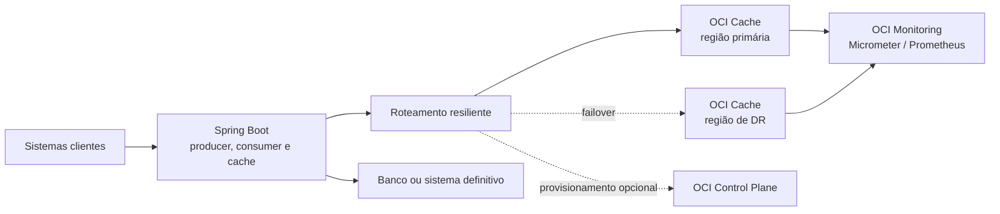

# Spring Boot resiliente com OCI Cache

Implementação de referência para cache, producer e consumer de Redis/Valkey
Streams no OCI Cache, com resiliência dentro da região, failover entre regiões e
provisionamento opcional de disaster recovery (DR).

O projeto pode ser executado localmente sem conta OCI. O ambiente local usa
Valkey em container e exercita as mesmas APIs Redis utilizadas no OCI Cache.

## Comece aqui

- [Guia completo de implementação](docs/IMPLEMENTATION_GUIDE.md): arquitetura,
  parâmetros, segurança, decisões e adaptação ao ambiente.
- [Guia de testes](docs/TESTING.md): testes automatizados, smoke test,
  inspeção de Streams e simulação de falhas.
- [.env.example](.env.example): inventário copiável das variáveis de ambiente.
- [application.yml](src/main/resources/application.yml): valores padrão e todos
  os parâmetros técnicos.

## Pré-requisitos

Escolha uma das opções:

| Opção | Requisitos | Quando usar |
|---|---|---|
| Containers | Docker 24+ com Compose v2 | Avaliação rápida e ambiente local reproduzível |
| Execução nativa | Java 17+, Maven 3.9+ e Docker apenas para o Valkey | Desenvolvimento e depuração na IDE |
| OCI | Requisitos anteriores, VCN/NSG, OCI Cache e credenciais | Homologação e produção |

Para baixar, use **Download ZIP** no repositório ou:

```bash
git clone <URL_DO_REPOSITORIO>
cd "Resilient HA OCI Cache"
```

O marcador `<URL_DO_REPOSITORIO>` deve ser substituído pela URL publicada pela
sua organização.

## Quickstart com Docker

Este caminho compila, executa os dez testes automatizados, cria o Valkey e inicia
a aplicação:

```bash
docker compose up --build -d
```

Quando a aplicação estiver pronta:

```bash
./scripts/smoke-test.sh
```

Resultado esperado:

```text
✅ Cache key/value com TTL passou
✅ Producer idempotente passou: redisId=<id>
✅ Health e status regional passaram
✅ Smoke test completo passou
```

Para acompanhar o consumer:

```bash
docker compose logs -f app
```

Para encerrar preservando os dados locais:

```bash
docker compose down
```

## Quickstart nativo

```bash
docker compose up -d redis
mvn -B clean verify
SPRING_PROFILES_ACTIVE=local mvn spring-boot:run
```

Em outro terminal:

```bash
./scripts/smoke-test.sh
```

Se Maven não estiver instalado, `./scripts/verify.sh` usa Docker
automaticamente:

```bash
./scripts/verify.sh
```

## Arquitetura high level



O OCI Cache acelera acesso e transporta eventos, mas não substitui o banco ou
log durável cross-region quando os dados não podem ser reconstruídos. O
`eventId` e o efeito de negócio devem ser gravados juntos no sistema definitivo
para tornar o consumer idempotente.

## Boas práticas implementadas

| Prática | Implementação | Quando usar |
|---|---|---|
| TLS e FQDN | TLS 1.2+ e validação do certificado; nenhum IP fixo | Sempre no OCI |
| Timeouts | Conexão/comando Redis e conexão/leitura do OCI SDK | Sempre |
| Conexões reutilizadas | Conexões Lettuce long-lived e uma conexão separada para leitura bloqueante | Sempre; pool só para operações stateful dedicadas |
| Topologia | `NON_SHARDED` e `SHARDED`; leitura opcional de réplicas | Sharded para escala; réplicas para leitura tolerante à consistência eventual |
| Spring Cache | TTL, namespace, JSON tipado, sem `null`, `putIfAbsent` e `clear()` O(1) | Dados derivados e reconstruíveis |
| Retry | Até 3 tentativas por padrão, máximo 5, backoff exponencial e jitter | Falhas transitórias e operações idempotentes |
| Circuit breaker | Resilience4j por endpoint regional | Impedir pressão sobre endpoint degradado |
| Failover regional | Health check, limiar, cooldown e standby | Quando a aplicação alcança as duas VCNs/regiões |
| Failback seguro | Desabilitado por padrão | Habilitar apenas com governança contra split-brain |
| Producer idempotente | `XADD` protegido por script Lua e `Idempotency-Key` | Sempre que o cliente puder repetir a requisição |
| Consumer groups | `XREADGROUP` com nome único do consumer | Escala horizontal de consumers |
| ACK seguro | `XACK` somente depois do processamento; falha de ACK não consome tentativa de negócio | Sempre |
| Retry de negócio | Contador persistente e idempotente com TTL | Erros transitórios do processamento |
| Erro permanente | `PermanentMessageProcessingException` envia diretamente à DLQ | Payload inválido ou regra que não será corrigida por retry |
| Dead Letter Stream | `XADD` na DLQ + `XACK` atômicos e idempotentes, com `MAXLEN` | Isolar poison messages sem bloquear o grupo |
| PEL | Métrica baseada em `XPENDING` | Detectar backlog e mensagens presas |
| Reclaim | `XAUTOCLAIM` por idle time | Recuperar mensagens de consumers mortos |
| Cluster hash tag | Stream, DLQ e chaves Lua usam a mesma `{orders}` | Obrigatório para scripts multi-key em cluster sharded |
| Observabilidade | Actuator, Prometheus, timers, contadores, PEL e status do breaker | Sempre em homologação/produção |
| ACL e segredo | Suporte a OCI Cache users; senha somente por variável/secret | Princípio do menor privilégio |
| Provisionamento de DR | Instance Principal, retry token, espera por `ACTIVE`, usuários e backup opcional | Apenas com controlador/líder único e RTO compatível |

Limitação deliberada: o modelo de Streams é **at-least-once**. Duplicatas são
possíveis se o processamento terminar e a confirmação for perdida. O handler de
negócio precisa ser idempotente.

## Configurar para OCI

Copie o modelo e preencha os valores `CHANGE_ME`:

```bash
cp .env.example .env
```

Carregue o arquivo apenas no shell atual:

```bash
set -a
source .env
set +a
mvn spring-boot:run
```

Configuração mínima para dois clusters já existentes:

```dotenv
OCI_CACHE_PRIMARY_FQDN=primary.example.redis.sa-saopaulo-1.oci.oraclecloud.com
OCI_CACHE_STANDBY_FQDN=primary.example.redis.sa-vinhedo-1.oci.oraclecloud.com
OCI_PRIMARY_REGION=sa-saopaulo-1
OCI_STANDBY_REGION=sa-vinhedo-1
OCI_CACHE_USERNAME=orders-app
OCI_CACHE_PASSWORD=valor-fornecido-por-secret
OCI_CACHE_MODE=NON_SHARDED
```

Não armazene `.env` em Git. Em produção, use OCI Vault, Kubernetes Secret ou o
secret manager padronizado pela organização.

## APIs para validação

| Método e caminho | Uso |
|---|---|
| `GET /actuator/health` | Saúde da aplicação e do roteador OCI Cache |
| `GET /actuator/prometheus` | Métricas |
| `GET /api/cache-status` | Região ativa, falhas e circuit breaker |
| `POST /api/cache/{key}` | Grava valor com TTL |
| `GET /api/cache/{key}` | Consulta valor |
| `POST /api/events` | Publica evento idempotente no Stream |

Exemplo:

```bash
curl -X POST http://localhost:8080/api/events \
  -H 'Content-Type: application/json' \
  -H 'Idempotency-Key: order-42-created' \
  -d '{"orderId":42,"status":"CREATED"}'
```

## Antes de produção

- Defina RTO e RPO e prefira warm standby quando minutos de provisionamento não
  forem aceitáveis.
- Garanta conectividade TCP 6379 entre a aplicação e ambos os clusters.
- Restrinja NSG, IAM e ACL por aplicação, comandos e padrões de chave.
- Faça teste de carga para ajustar TTL, memória, `batch-size`, timeouts e alarmes.
- Use um único controlador para provisionamento/failover global.
- Mantenha o banco ou log definitivo fora do cache.
- Execute `./scripts/verify.sh` no pipeline e o smoke test em cada ambiente.
- Faça exercícios periódicos de DR e documente o resultado de RPO/RTO.

As decisões, parâmetros, diagramas técnicos, glossário e referências oficiais
estão no [guia completo](docs/IMPLEMENTATION_GUIDE.md).
