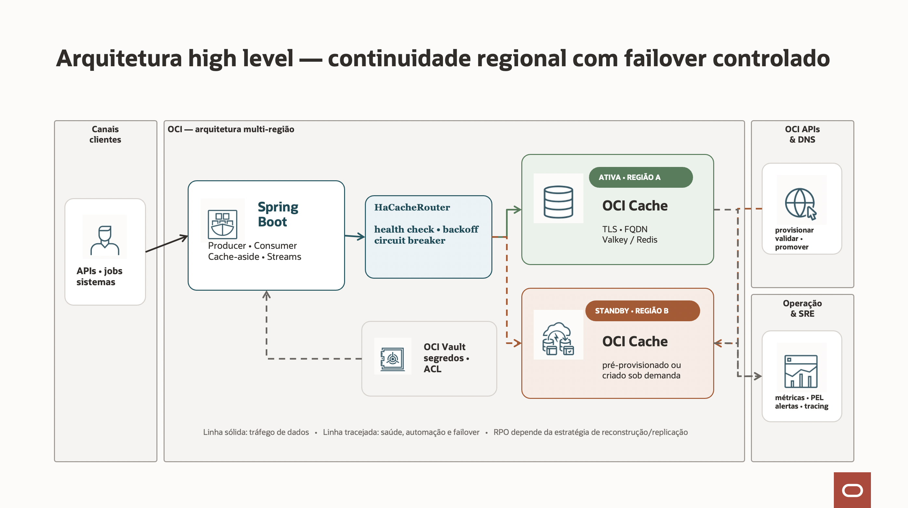
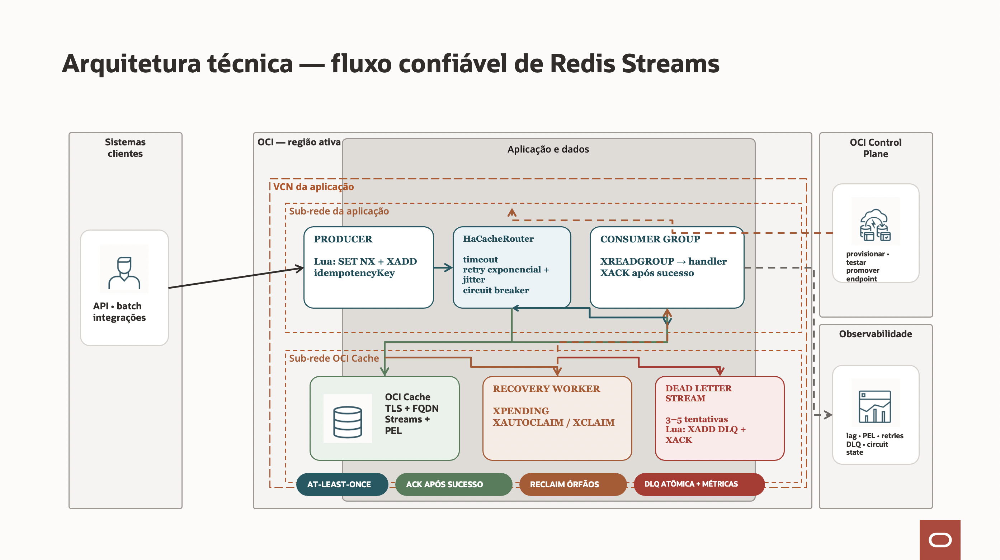

# Spring Boot resiliente com OCI Cache

Implementação de referência para cache, producer e consumer de Redis/Valkey
Streams no OCI Cache, com resiliência dentro da região, failover entre regiões e
provisionamento opcional de disaster recovery (DR).

O projeto pode ser executado localmente sem conta OCI. O ambiente local usa
Valkey em container e exercita as mesmas APIs Redis utilizadas no OCI Cache.

## O que este código faz

Este projeto é uma aplicação Spring Boot que usa o OCI Cache, compatível com
Redis/Valkey, para três funções principais:

- guardar dados temporários em cache;
- publicar eventos em Redis Streams;
- consumir e processar esses eventos com segurança.

### Fluxo básico

```text
Cliente
   ↓
Aplicação Spring Boot
   ↓
HaCacheRouter
   ↓
OCI Cache da região ativa
   ↓ falha
OCI Cache da região de DR
```

### Cache

Quando a aplicação precisa consultar um dado:

1. Primeiro procura no OCI Cache.
2. Se encontrar, devolve rapidamente.
3. Se não encontrar, consulta o sistema definitivo.
4. Salva o resultado no cache com um tempo de expiração, o **TTL**.

O OCI Cache é tratado como dado temporário. O banco ou sistema definitivo
continua sendo a fonte oficial.

### Producer

O producer recebe uma requisição e publica uma mensagem em um Redis Stream
usando `XADD`.

Ele é idempotente: se a mesma requisição for enviada novamente com a mesma chave
de idempotência, o projeto evita publicar o mesmo evento duas vezes.

```text
Requisição
   ↓
Verifica a chave de idempotência
   ↓
Publica no Stream somente se ainda não existir
```

A verificação da chave e a publicação são executadas atomicamente por um script
Lua.

### Consumer

O consumer lê as mensagens usando Consumer Groups e `XREADGROUP`.

```text
XREADGROUP
   ↓
Processa a mensagem
   ↓
Sucesso?
 ├─ Sim → XACK
 └─ Não → mantém na PEL para tentar novamente
```

O `XACK` só acontece depois que o processamento termina com sucesso. Isso evita
marcar uma mensagem como concluída antes de executar o trabalho.

### Retry e DLQ

Se o processamento falhar temporariamente, a mensagem pode ser tentada
novamente:

- o número de tentativas é limitado;
- existe backoff exponencial com jitter;
- erros permanentes não são repetidos indefinidamente;
- depois do limite, a mensagem é movida para a Dead Letter Stream, ou **DLQ**.

A movimentação para a DLQ e o `XACK` são feitos atomicamente para reduzir o risco
de perda ou duplicação indevida.

### PEL e mensagens órfãs

Mensagens entregues, mas ainda não confirmadas, ficam na Pending Entries List,
ou **PEL**. O projeto:

- monitora a quantidade de mensagens pendentes;
- usa `XPENDING` para acompanhar o backlog;
- usa `XAUTOCLAIM` para recuperar mensagens abandonadas por consumers que
  morreram;
- expõe métricas para alertas.

### Alta disponibilidade

O `HaCacheRouter` mantém os endpoints das regiões disponíveis. Quando o OCI
Cache ativo apresenta falhas consecutivas:

1. O circuit breaker impede chamadas excessivas ao endpoint com problema.
2. O sistema verifica a região de standby.
3. Se estiver saudável, passa a usar o endpoint de DR.
4. Se o provisionamento automático estiver habilitado, o OCI SDK pode iniciar a
   criação de outro cluster.
5. O novo cluster só é usado depois de ficar ativo e passar nas verificações de
   saúde.

O projeto evita failback automático por padrão para reduzir o risco de
alternância constante entre regiões e de split-brain.

### Segurança

A conexão foi projetada para usar:

- TLS;
- FQDN em vez de IP fixo;
- credenciais por variável de ambiente ou secret manager;
- usuários e ACLs do OCI Cache;
- NSGs restringindo o acesso à porta 6379.

### Monitoramento

O Spring Boot Actuator e o Micrometer expõem informações como:

- região ativa;
- estado dos circuit breakers;
- falhas e retries;
- tamanho da PEL;
- mensagens enviadas para a DLQ;
- latência dos comandos;
- disponibilidade dos clusters.

Em resumo, o projeto procura evitar que uma falha do OCI Cache derrube
imediatamente a aplicação. As mensagens são processadas no modelo
**at-least-once**, com recuperação de pendências e isolamento de mensagens
defeituosas. Por isso, o banco ou log durável continua sendo a fonte da verdade,
e o handler de negócio precisa ser idempotente.

## Comece aqui

- [Guia completo de implementação](docs/IMPLEMENTATION_GUIDE.md): arquitetura,
  parâmetros, segurança, decisões e adaptação ao ambiente.
- [Guia de testes](docs/TESTING.md): testes automatizados, smoke test,
  inspeção de Streams e simulação de falhas.
- [Terraform da demo](terraform/README.md): provisionamento do OCI Cache
  primário/DR, redes privadas, NSGs, usuários opcionais e outputs da aplicação.
- [.env.example](.env.example): inventário copiável das variáveis de ambiente.
- [application.yml](src/main/resources/application.yml): valores padrão e todos
  os parâmetros técnicos.

## Pré-requisitos

Escolha uma das opções:

| Opção | Requisitos | Quando usar |
|---|---|---|
| Containers | Docker 24+ com Compose v2 | Avaliação rápida e ambiente local reproduzível |
| Execução nativa | Java 17+, Maven 3.9+ e Docker apenas para o Valkey | Desenvolvimento e depuração na IDE |
| OCI | Requisitos anteriores, VCN/NSG, OCI Cache e credenciais | Homologação e produção |
| Terraform OCI | Terraform 1.6+, provider OCI, compartment e autenticação configurada | Criar os clusters e redes da demo |

Para baixar, use **Download ZIP** no repositório ou:

```bash
git clone <URL_DO_REPOSITORIO>
cd "Resilient HA OCI Cache"
```

O marcador `<URL_DO_REPOSITORIO>` deve ser substituído pela URL publicada pela
sua organização.

## Quickstart com Docker

Este caminho compila, executa os dez testes automatizados, cria o Valkey e inicia
a aplicação:

```bash
docker compose up --build -d
```

Quando a aplicação estiver pronta:

```bash
./scripts/smoke-test.sh
```

Resultado esperado:

```text
✅ Cache key/value com TTL passou
✅ Producer idempotente passou: redisId=<id>
✅ Health e status regional passaram
✅ Smoke test completo passou
```

Para acompanhar o consumer:

```bash
docker compose logs -f app
```

Para encerrar preservando os dados locais:

```bash
docker compose down
```

## Quickstart nativo

```bash
docker compose up -d redis
mvn -B clean verify
SPRING_PROFILES_ACTIVE=local mvn spring-boot:run
```

Em outro terminal:

```bash
./scripts/smoke-test.sh
```

Se Maven não estiver instalado, `./scripts/verify.sh` usa Docker
automaticamente:

```bash
./scripts/verify.sh
```

## Executar pelo Eclipse

Sim, o projeto pode ser importado e executado diretamente no Eclipse. Para o
ambiente local, o Eclipse executa a aplicação Spring Boot e o Docker executa
somente o Valkey.

### 1. Instalar os pré-requisitos

Instale:

- Git;
- JDK 17;
- Docker Desktop com Docker Compose v2;
- Eclipse IDE for Java Developers;
- opcionalmente, **Spring Tools 4** pelo Eclipse Marketplace.

Confirme no terminal:

```bash
java -version
docker --version
docker compose version
git --version
```

O resultado de `java -version` deve indicar Java 17 ou uma versão posterior
compatível.

### 2. Baixar o projeto

No terminal:

```bash
git clone https://github.com/SilvioCristiano/Resilient-HA-OCI-Cache.git
cd Resilient-HA-OCI-Cache
```

Também é possível usar no Eclipse:

1. Acesse **File → Import**.
2. Selecione **Git → Projects from Git**.
3. Escolha **Clone URI**.
4. Informe a URL do repositório.
5. Ao final, selecione a importação como projeto Maven existente.

### 3. Importar como projeto Maven

Se o repositório já estiver na máquina:

1. Acesse **File → Import**.
2. Selecione **Maven → Existing Maven Projects**.
3. Em **Root Directory**, escolha a pasta do repositório.
4. Confirme que o arquivo `pom.xml` foi selecionado.
5. Clique em **Finish**.
6. Aguarde o Eclipse baixar e indexar as dependências.

Se ainda houver erros no projeto, clique com o botão direito no projeto e
selecione **Maven → Update Project**, marque **Force Update of Snapshots/Releases**
e confirme.

### 4. Configurar o Java 17 no Eclipse

1. Acesse **Window → Preferences → Java → Installed JREs**.
2. Adicione ou selecione o JDK 17.
3. Clique com o botão direito no projeto e abra **Properties**.
4. Em **Java Build Path**, confirme que o JDK 17 está selecionado.
5. Em **Java Compiler**, use o nível de compilação 17.

### 5. Iniciar o Valkey local

Com o Docker Desktop em execução, abra um terminal na raiz do projeto. Pode ser
o terminal do sistema ou a view **Terminal** do Eclipse:

```bash
docker compose up -d redis
docker compose ps
```

O serviço `redis` deve aparecer como saudável e publicar a porta `6379`.

### 6. Criar a configuração de execução

Sem o Spring Tools:

1. Acesse **Run → Run Configurations → Java Application**.
2. Clique em **New launch configuration**.
3. Em **Project**, selecione o projeto importado.
4. Em **Main class**, selecione
   `com.example.ocicache.OciCacheApplication`.
5. Na aba **Environment**, adicione:

   ```text
   SPRING_PROFILES_ACTIVE=local
   ```

6. Clique em **Apply** e depois em **Run**.

Com o Spring Tools instalado:

1. Acesse **Run → Run Configurations → Spring Boot App**.
2. Clique em **New launch configuration**.
3. Selecione o projeto e a classe
   `com.example.ocicache.OciCacheApplication`.
4. Na aba de profile ou em **Environment**, configure:

   ```text
   SPRING_PROFILES_ACTIVE=local
   ```

5. Clique em **Apply** e depois em **Run**.

O profile `local` conecta a aplicação a `localhost:6379`, desabilita TLS e não
exige uma conta OCI. No console do Eclipse, aguarde a mensagem indicando que a
aplicação iniciou na porta `8080`.

### 7. Executar os testes no Eclipse

1. Clique com o botão direito no projeto.
2. Selecione **Run As → Maven test**.
3. Confirme que o build termina com `BUILD SUCCESS`.

Também é possível executar uma classe individual em `src/test/java` usando
**Run As → JUnit Test**.

### 8. Validar a aplicação

Em outro terminal, na raiz do projeto:

```bash
./scripts/smoke-test.sh
```

No Windows, execute o script usando Git Bash ou WSL. Resultado esperado:

```text
✅ Cache key/value com TTL passou
✅ Producer idempotente passou: redisId=<id>
✅ Health e status regional passaram
✅ Smoke test completo passou
```

Também é possível abrir no navegador:

- `http://localhost:8080/actuator/health`;
- `http://localhost:8080/api/cache-status`;
- `http://localhost:8080/actuator/prometheus`.

O producer pode ser testado no terminal:

```bash
curl -X POST http://localhost:8080/api/events \
  -H 'Content-Type: application/json' \
  -H 'Idempotency-Key: eclipse-order-42' \
  -d '{"orderId":42,"status":"CREATED"}'
```

### 9. Encerrar

Interrompa a aplicação pelo botão vermelho **Terminate** no console do Eclipse.
Depois encerre o Valkey:

```bash
docker compose down
```

Use `docker compose down -v` somente quando quiser apagar também os dados locais
do Valkey.

### Problemas comuns no Eclipse

| Problema | Correção |
|---|---|
| `Connection refused: localhost/127.0.0.1:6379` | Inicie o Docker Desktop e execute `docker compose up -d redis` |
| A aplicação tenta usar endpoints OCI | Confirme `SPRING_PROFILES_ACTIVE=local` na configuração de execução |
| Porta `8080` ocupada | Encerre o processo existente ou informe `SERVER_PORT=8081` e use essa porta no teste |
| Porta `6379` ocupada | Encerre outra instalação Redis/Valkey antes de iniciar o container |
| Classes ou dependências não encontradas | Execute **Maven → Update Project** e depois **Project → Clean** |
| Versão Java incompatível | Configure o projeto e a execução para usar o JDK 17 |
| Script sem permissão no Linux/macOS | Execute `chmod +x scripts/smoke-test.sh` |

## Arquitetura high level



## Arquitetura técnica



O OCI Cache acelera acesso e transporta eventos, mas não substitui o banco ou
log durável cross-region quando os dados não podem ser reconstruídos. O
`eventId` e o efeito de negócio devem ser gravados juntos no sistema definitivo
para tornar o consumer idempotente.

## Boas práticas implementadas

| Prática | Implementação | Quando usar |
|---|---|---|
| TLS e FQDN | TLS 1.2+ e validação do certificado; nenhum IP fixo | Sempre no OCI |
| Timeouts | Conexão/comando Redis e conexão/leitura do OCI SDK | Sempre |
| Conexões reutilizadas | Conexões Lettuce long-lived e uma conexão separada para leitura bloqueante | Sempre; pool só para operações stateful dedicadas |
| Topologia | `NON_SHARDED` e `SHARDED`; leitura opcional de réplicas | Sharded para escala; réplicas para leitura tolerante à consistência eventual |
| Spring Cache | TTL, namespace, JSON tipado, sem `null`, `putIfAbsent` e `clear()` O(1) | Dados derivados e reconstruíveis |
| Retry | Até 3 tentativas por padrão, máximo 5, backoff exponencial e jitter | Falhas transitórias e operações idempotentes |
| Circuit breaker | Resilience4j por endpoint regional | Impedir pressão sobre endpoint degradado |
| Failover regional | Health check, limiar, cooldown e standby | Quando a aplicação alcança as duas VCNs/regiões |
| Failback seguro | Desabilitado por padrão | Habilitar apenas com governança contra split-brain |
| Producer idempotente | `XADD` protegido por script Lua e `Idempotency-Key` | Sempre que o cliente puder repetir a requisição |
| Consumer groups | `XREADGROUP` com nome único do consumer | Escala horizontal de consumers |
| ACK seguro | `XACK` somente depois do processamento; falha de ACK não consome tentativa de negócio | Sempre |
| Retry de negócio | Contador persistente e idempotente com TTL | Erros transitórios do processamento |
| Erro permanente | `PermanentMessageProcessingException` envia diretamente à DLQ | Payload inválido ou regra que não será corrigida por retry |
| Dead Letter Stream | `XADD` na DLQ + `XACK` atômicos e idempotentes, com `MAXLEN` | Isolar poison messages sem bloquear o grupo |
| PEL | Métrica baseada em `XPENDING` | Detectar backlog e mensagens presas |
| Reclaim | `XAUTOCLAIM` por idle time | Recuperar mensagens de consumers mortos |
| Cluster hash tag | Stream, DLQ e chaves Lua usam a mesma `{orders}` | Obrigatório para scripts multi-key em cluster sharded |
| Observabilidade | Actuator, Prometheus, timers, contadores, PEL e status do breaker | Sempre em homologação/produção |
| ACL e segredo | Suporte a OCI Cache users; senha somente por variável/secret | Princípio do menor privilégio |
| Provisionamento de DR | Instance Principal, retry token, espera por `ACTIVE`, usuários e backup opcional | Apenas com controlador/líder único e RTO compatível |

Limitação deliberada: o modelo de Streams é **at-least-once**. Duplicatas são
possíveis se o processamento terminar e a confirmação for perdida. O handler de
negócio precisa ser idempotente.

## Configurar para OCI

Copie o modelo e preencha os valores `CHANGE_ME`:

```bash
cp .env.example .env
```

Carregue o arquivo apenas no shell atual:

```bash
set -a
source .env
set +a
mvn spring-boot:run
```

Configuração mínima para dois clusters já existentes:

```dotenv
OCI_CACHE_PRIMARY_FQDN=primary.example.redis.sa-saopaulo-1.oci.oraclecloud.com
OCI_CACHE_STANDBY_FQDN=primary.example.redis.sa-vinhedo-1.oci.oraclecloud.com
OCI_PRIMARY_REGION=sa-saopaulo-1
OCI_STANDBY_REGION=sa-vinhedo-1
OCI_CACHE_USERNAME=orders-app
OCI_CACHE_PASSWORD=valor-fornecido-por-secret
OCI_CACHE_MODE=NON_SHARDED
```

Não armazene `.env` em Git. Em produção, use OCI Vault, Kubernetes Secret ou o
secret manager padronizado pela organização.

## Provisionar a demo com Terraform

O diretório [`terraform/`](terraform/) cria:

- uma VCN e subnet privada em cada região, ou usa redes existentes;
- um NSG por região liberando somente TLS/6379 dos CIDRs informados;
- um OCI Cache primário e um OCI Cache de DR;
- clusters `NONSHARDED` ou `SHARDED` com Valkey 8.1 por padrão;
- criação opcional de OCI Cache users e associação dos usuários aos clusters;
- outputs com FQDNs, OCIDs, subnet, NSG e variáveis do Spring Boot.

Quickstart:

```bash
cd terraform
cp terraform.tfvars.example terraform.tfvars
# Edite compartment_id, regiões, CIDRs e OCI Cache users.
terraform init
terraform fmt -check -recursive
terraform validate
terraform plan -out=tfplan
terraform apply tfplan
terraform output spring_boot_environment
terraform output -raw spring_boot_dotenv > ../.env.terraform
```

Para validar formatação, módulos e schema do provider em um único comando:

```bash
./scripts/terraform-check.sh
```

Revise `.env.terraform` e substitua `OCI_CACHE_PASSWORD=CHANGE_ME` pela senha
obtida do secret manager. A senha em texto puro não é criada nem exibida pelo
Terraform.

As subnets do OCI Cache são privadas. O runtime do Spring Boot precisa ter DNS e
rota para as duas regiões por meio da topologia aprovada pela organização, como
DRG/remote peering, FastConnect ou VPN. O stack não cria essa conectividade
porque ela normalmente pertence à rede central do cliente.

Terraform provisiona os recursos, mas não replica automaticamente Streams entre
regiões. A troca de endpoint é feita pelo `HaCacheRouter`; a estratégia de
backup, reconstrução e RPO precisa ser definida conforme a criticidade dos
dados.

## APIs para validação

| Método e caminho | Uso |
|---|---|
| `GET /actuator/health` | Saúde da aplicação e do roteador OCI Cache |
| `GET /actuator/prometheus` | Métricas |
| `GET /api/cache-status` | Região ativa, falhas e circuit breaker |
| `POST /api/cache/{key}` | Grava valor com TTL |
| `GET /api/cache/{key}` | Consulta valor |
| `POST /api/events` | Publica evento idempotente no Stream |

Exemplo:

```bash
curl -X POST http://localhost:8080/api/events \
  -H 'Content-Type: application/json' \
  -H 'Idempotency-Key: order-42-created' \
  -d '{"orderId":42,"status":"CREATED"}'
```

## Antes de produção

- Defina RTO e RPO e prefira warm standby quando minutos de provisionamento não
  forem aceitáveis.
- Garanta conectividade TCP 6379 entre a aplicação e ambos os clusters.
- Restrinja NSG, IAM e ACL por aplicação, comandos e padrões de chave.
- Faça teste de carga para ajustar TTL, memória, `batch-size`, timeouts e alarmes.
- Use um único controlador para provisionamento/failover global.
- Mantenha o banco ou log definitivo fora do cache.
- Execute `./scripts/verify.sh` no pipeline e o smoke test em cada ambiente.
- Faça exercícios periódicos de DR e documente o resultado de RPO/RTO.

As decisões, parâmetros, diagramas técnicos, glossário e referências oficiais
estão no [guia completo](docs/IMPLEMENTATION_GUIDE.md).
