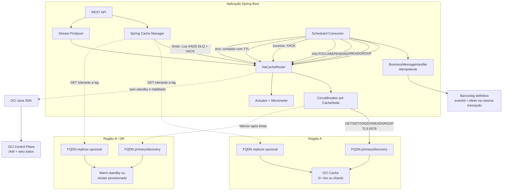

# Guia de implementação no ambiente do cliente

Este documento explica como adaptar a referência para desenvolvimento,
homologação e produção. Valores padrão são seguros para começar, mas capacidade,
latência, RTO, RPO e regras de segurança precisam ser confirmados no ambiente
real.

## 1. Escopo e responsabilidades

O projeto entrega:

- integração Spring Boot/Lettuce com OCI Cache;
- cache Spring, producer e consumer de Redis/Valkey Streams;
- resiliência do cliente e troca entre endpoints regionais;
- provisionamento opcional de um cluster na região de DR;
- métricas, health checks e testes de comportamento.

O projeto não entrega:

- replicação síncrona automática de Streams entre regiões;
- eleição distribuída global para decidir o único writer;
- criação de VCN, subnet, NSG, Vault, Dynamic Group ou políticas IAM;
- garantia exactly-once;
- substituição de um banco ou log durável.

### Versões da referência

| Componente | Versão |
|---|---:|
| Java | 17 |
| Spring Boot | 3.5.16 |
| OCI Java SDK | 3.92.0 |
| Resilience4j | 2.3.0 |
| Valkey local | 8.1 |

Valide a matriz de versões e a política de atualização da sua organização antes
de promover. Atualizações devem repetir compilação, smoke test, teste de carga e
exercício de failover.

## 2. Arquitetura técnica



### Fluxo do consumer

```mermaid
sequenceDiagram
    participant R as Redis/Valkey
    participant C as StreamConsumer
    participant H as Handler idempotente
    participant D as Banco definitivo

    C->>R: XAUTOCLAIM mensagens órfãs
    C->>R: XREADGROUP GROUP grupo consumer
    R-->>C: mensagem e registro na PEL
    C->>H: handle(eventId, payload)
    H->>D: transação(eventId + efeito)
    alt processamento bem-sucedido
        D-->>H: commit
        C->>R: XACK
    else erro transitório abaixo do limite
        C->>R: INCR idempotente + TTL
        Note over C,R: sem ACK; mensagem permanece na PEL
    else erro permanente ou limite atingido
        C->>R: Lua: XADD DLQ + XACK + marcador
        Note over C,R: operação atômica e idempotente
    end
```

## 3. Escolha da topologia

### Non-sharded

Use quando a capacidade de um cluster sem particionamento atende ao volume e a
simplicidade operacional é prioritária. Configure pelo menos três nós para
produção. Escritas e Streams usam o primary FQDN; leituras podem usar o replicas
FQDN quando consistência eventual for aceitável.

### Sharded

Use quando throughput ou memória exigirem particionamento. O cliente Lettuce
descobre a topologia pelo discovery FQDN. Operações Lua com múltiplas chaves
precisam estar no mesmo slot; por isso o projeto valida a hash tag `{orders}` no
stream, DLQ, deduplicação e contadores.

### Warm standby versus provisionamento on-demand

| Estratégia | Benefício | Custo/risco | Indicada quando |
|---|---|---|---|
| Warm standby | Menor RTO e teste antecipado de conectividade | Custo contínuo | Aplicações críticas |
| On-demand | Menor custo parado | RTO de vários minutos e mais dependências | Cache reconstruível e RTO flexível |
| Somente cluster primário | Simplicidade | Sem DR regional da aplicação | Desenvolvimento ou risco aceito |

## 4. Parâmetros

### Endpoints e credenciais

| Parâmetro | Padrão | Descrição |
|---|---:|---|
| `OCI_CACHE_PRIMARY_FQDN` | vazio | Primary ou discovery FQDN da região principal |
| `OCI_CACHE_STANDBY_FQDN` | vazio | Primary ou discovery FQDN da região de DR |
| `OCI_CACHE_MODE` | `NON_SHARDED` | `NON_SHARDED` ou `SHARDED` |
| `OCI_CACHE_USERNAME` | vazio | OCI Cache user |
| `OCI_CACHE_PASSWORD` | vazio | Segredo do usuário |
| `OCI_CACHE_READ_FROM_REPLICAS` | `false` | Distribui somente leituras elegíveis |

Use exclusivamente os FQDNs fornecidos pelo OCI Cache. Não fixe os IPs
resolvidos pelo DNS.

### Resiliência

| Propriedade Spring | Padrão | Como ajustar |
|---|---:|---|
| `app.cache.failover.command-attempts` | `3` | Mantenha entre 3 e 5; aumente somente para falhas realmente transitórias |
| `command-timeout` | `3s` | Deve ser maior que a latência p99 normal e menor que o timeout do chamador |
| `connect-timeout` | `3s` | Reduza em redes locais; preserve margem em tráfego cross-region |
| `retry-backoff` | `500ms` | Base do backoff exponencial |
| `retry-max-backoff` | `5s` | Limita o impacto na latência total |
| `retry-jitter` | `0.5` | Evita que todas as instâncias repitam juntas |
| `failure-threshold` | `3` | Falhas consecutivas antes da troca regional |
| `circuit-breaker-minimum-calls` | `5` | Evita decisão com amostra pequena |
| `circuit-breaker-open-duration` | `10s` | Tempo antes de testar recuperação |
| `cooldown` | `2m` | Evita flapping |
| `automatic-failback` | `false` | Preserve `false` até existir processo explícito contra split-brain |

Retry deve envolver somente operações idempotentes ou protegidas por
idempotência. Os scripts de publicação, contador de falhas e DLQ têm marcadores
para que uma resposta perdida não repita o efeito.

### Streams

| Propriedade | Padrão | Finalidade |
|---|---:|---|
| `stream.key` | `{orders}:stream` | Stream principal e hash tag |
| `consumer-group` | `orders-service` | Grupo que divide trabalho |
| `consumer-name` | `${HOSTNAME:local}` | Identidade única da instância |
| `batch-size` | `10` | Limita trabalho e memória por polling |
| `poll-timeout` | `2s` | Tempo máximo do `XREADGROUP BLOCK` |
| `pending-min-idle` | `1m` | Espera antes de considerar mensagem órfã |
| `max-processing-attempts` | `5` | Limite antes da DLQ |
| `failure-tracking-ttl` | `7d` | Retenção de marcadores idempotentes |
| `dead-letter-key` | `{orders}:stream:dlq` | Stream de erros permanentes |
| `dead-letter-max-length` | `100000` | Limite aproximado da DLQ |
| `pel-monitor-interval` | `15s` | Frequência do `XPENDING` resumido |

`pending-min-idle` precisa superar o maior tempo normal de processamento.
Valores menores podem reassumir uma mensagem que ainda está sendo processada.

### Spring Cache

| Propriedade | Padrão | Orientação |
|---|---:|---|
| `spring.namespace` | aplicação + ambiente | Nunca compartilhe namespace entre ambientes |
| `spring.default-ttl` | `10m` | Use o menor TTL compatível com o negócio |
| `spring.cache-names` | lista explícita | Evita cache criado por erro de digitação |
| `spring.ttl-by-cache` | por cache | Ajuste conforme volatilidade e custo de reconstrução |

Não use Spring Cache para informação que não possa ser reconstruída. Leia de
réplicas somente quando o possível lag for aceito.

### Provisionamento OCI

O provisionamento fica desabilitado por padrão. Quando habilitado, são
necessários compartment, subnet, NSG, região de destino e políticas IAM. Prefira
Instance Principal em runtime OCI.

Timeouts adicionais:

- `api-connect-timeout`: 5 segundos;
- `api-read-timeout`: 30 segundos;
- `ready-timeout`: 30 minutos para o cluster chegar a `ACTIVE`;
- `poll-interval`: 20 segundos.

Use apenas um controlador global de DR. O `AtomicBoolean` do projeto impede
duplicidade dentro de uma JVM, não entre réplicas.

## 5. Segurança e rede

Checklist:

- permitir TCP 6379 somente das subnets/NSGs das aplicações;
- garantir rota, DRG/peering e DNS entre a aplicação e a região de standby;
- TLS habilitado e certificado verificado;
- OCI Cache user exclusivo por aplicação;
- ACL limitada aos comandos e padrões de chave usados;
- senha injetada por secret, nunca por Git ou imagem;
- Instance Principal em vez de chave estática quando executado no OCI;
- IAM de provisionamento concedido somente ao controlador de DR;
- rotação de senha testada sem reinicialização simultânea de todas as réplicas;
- logs sem payload sensível.

Políticas de referência, que devem ser restringidas aos compartments reais:

```text
Allow dynamic-group <DR_DYNAMIC_GROUP> to manage redis-family in compartment <CACHE_COMPARTMENT>
Allow dynamic-group <DR_DYNAMIC_GROUP> to use virtual-network-family in compartment <NETWORK_COMPARTMENT>
```

## 6. Observabilidade e alarmes

Métricas da aplicação:

| Métrica | Uso operacional |
|---|---|
| `oci.cache.operation` | Latência e resultado por comando/região |
| `oci.cache.failovers` | Quantidade de trocas regionais |
| `oci.cache.stream.processed` | Mensagens confirmadas |
| `oci.cache.stream.failed` | Falhas de negócio |
| `oci.cache.stream.reclaimed` | Mensagens órfãs reassumidas |
| `oci.cache.stream.dead_lettered` | Mensagens isoladas |
| `oci.cache.stream.pending` | Tamanho atual da PEL |

No OCI, monitore pelo menos CPU, memória, conexões, chaves evictadas e
replication lag. Crie alarmes para:

- PEL crescendo continuamente;
- qualquer crescimento inesperado da DLQ;
- circuit breaker aberto;
- taxa de erro e latência acima do SLO;
- memória próxima do limite ou eviction inesperada;
- standby inacessível;
- backup ou exercício de DR atrasado.

## 7. Adaptação do handler

`BusinessMessageHandler` é propositalmente um exemplo. Substitua seu conteúdo
pela operação real e garanta:

1. validação do schema antes de efeitos colaterais;
2. `eventId` como chave de idempotência;
3. gravação de `eventId` e efeito na mesma transação;
4. timeout e circuit breaker no adapter de cada dependência remota;
5. `PermanentMessageProcessingException` apenas quando retry não puder corrigir;
6. ausência de `XACK` manual: o consumer já confirma depois do retorno.

Exemplo conceitual:

```java
@Transactional
public void handle(CacheMessage message) {
    if (processedEventRepository.existsById(message.eventId())) {
        return;
    }
    OrderEvent event = parseAndValidate(message.payload());
    orderRepository.apply(event);
    processedEventRepository.save(new ProcessedEvent(message.eventId()));
}
```

## 8. Processo recomendado de implantação

1. Execute os testes locais descritos em [TESTING.md](TESTING.md).
2. Crie clusters, users, ACLs, Vault secrets, NSGs e rotas.
3. Valide DNS/TLS/6379 a partir da mesma subnet da aplicação.
4. Suba uma instância com consumer desabilitado e valide cache/producer.
5. Habilite um consumer e acompanhe PEL, DLQ e latência.
6. Faça carga gradual e ajuste capacidade/timeouts.
7. Valide queda do nó/cluster primário em homologação.
8. Valide o standby sem habilitar failback automático.
9. Registre RTO/RPO observado e aprove o runbook.
10. Só então escale producers e consumers.

## 9. O que adaptar ou complementar no ambiente

| Item | Situação nesta referência | Melhoria recomendada |
|---|---|---|
| Handler de negócio | Apenas registra o evento no log | Implementar transação idempotente real no banco |
| Contrato do evento | JSON livre | Adotar validação de schema e estratégia de evolução |
| Re-drive da DLQ | Inspeção manual | Criar processo auditável que corrija e republique com nova idempotência |
| DR cross-region dos eventos | Não replica Streams | Usar fila/log durável cross-region quando perder eventos não for aceitável |
| Liderança de DR | Proteção apenas dentro da JVM | Usar OCI Full Stack DR, Function, lease distribuído ou controlador único |
| Infraestrutura | Não criada pelo projeto | Gerenciar VCN, NSG, IAM, Vault, alarmes e clusters por IaC |
| Rotação de segredo | Variável na inicialização | Integrar ao mecanismo de rotação e recarregamento da organização |
| Observabilidade | Métricas básicas | Criar dashboard, alertas por SLO e correlação com tracing/logs |
| Teste integrado | Valkey local e testes de componentes | Adicionar pipeline em OCI descartável com TLS, ACL e topologia real |
| Capacidade | Defaults conservadores | Executar carga para dimensionar nós/shards, lote, TTL e conexões |
| Política de eviction | Fora do código | Configurar conforme cache derivado versus dado não reconstruível |
| Backup/restore | Suporte opcional | Automatizar agenda, cópia cross-region e testes periódicos de restore |
| Segurança de payload | Log de exemplo contém payload | Remover, mascarar ou classificar dados sensíveis |

Essas adaptações não são defeitos do mecanismo de resiliência; são decisões que
dependem do banco, criticidade, volume, compliance e modelo operacional de cada
cliente.

## 10. Glossário

| Termo | Descrição |
|---|---|
| ACL | Lista de controle que restringe comandos e chaves permitidos ao usuário |
| ACK / `XACK` | Confirma que uma mensagem do consumer group terminou e pode sair da PEL |
| At-least-once | Uma mensagem é processada uma ou mais vezes; exige idempotência |
| Backoff | Espera crescente entre retries |
| Circuit breaker | Interrompe chamadas para dependência degradada e testa recuperação depois |
| Consumer group | Conjunto de consumers que divide mensagens de um Stream |
| DLQ/DLS | Fila ou Stream separado para mensagens que não puderam ser processadas |
| DR | Disaster recovery, recuperação após indisponibilidade relevante |
| Failover | Troca do endpoint ativo para um standby |
| Failback | Retorno controlado ao endpoint preferido |
| FQDN | Nome DNS completo fornecido pelo serviço |
| Hash tag | Trecho entre `{}` que força chaves ao mesmo slot do cluster |
| Idempotência | Repetir uma operação produz o mesmo efeito lógico |
| Jitter | Aleatoriedade no retry para evitar rajadas sincronizadas |
| PEL | Pending Entries List do consumer group |
| RPO | Quantidade máxima de dados que pode ser perdida |
| RTO | Tempo máximo esperado para restaurar o serviço |
| Shard | Partição de dados em um cluster sharded |
| Split-brain | Duas regiões aceitando escrita como autoridade ao mesmo tempo |
| TTL | Tempo até a expiração automática de uma chave |
| `XAUTOCLAIM` | Transfere mensagens ociosas da PEL para outro consumer |
| `XPENDING` | Consulta resumo ou detalhes da PEL |
| `XREADGROUP` | Lê Streams por consumer group |

## 11. Referências oficiais

OCI:

- [OCI Cache – visão geral](https://docs.oracle.com/en-us/iaas/Content/ocicache/home.htm)
- [Criar um cluster](https://docs.oracle.com/en-us/iaas/Content/ocicache/createcluster.htm)
- [Conectar ao cluster](https://docs.oracle.com/en-us/iaas/Content/ocicache/connecttocluster.htm)
- [Boas práticas do cliente](https://docs.oracle.com/en-us/iaas/Content/ocicache/ocicachebestpractices.htm)
- [Backup e restore](https://docs.oracle.com/en-us/iaas/Content/ocicache/backup-restore.htm)
- [Políticas IAM](https://docs.oracle.com/en-us/iaas/Content/ocicache/permissions.htm)
- [Métricas do OCI Cache](https://docs.oracle.com/en-us/iaas/Content/ocicache/metrics.htm)

Redis/Valkey:

- [Redis Streams](https://redis.io/docs/latest/develop/data-types/streams/)
- [`XREADGROUP`](https://redis.io/docs/latest/commands/xreadgroup/)
- [`XACK`](https://redis.io/docs/latest/commands/xack/)
- [`XPENDING`](https://redis.io/docs/latest/commands/xpending/)
- [`XAUTOCLAIM`](https://redis.io/docs/latest/commands/xautoclaim/)
- [Redis Cluster specification e hash tags](https://redis.io/docs/latest/operate/oss_and_stack/reference/cluster-spec/)

Spring/Lettuce/Resilience4j:

- [Spring Data Redis – Streams](https://docs.spring.io/spring-data/redis/reference/redis/redis-streams.html)
- [Spring Data Redis – modos de conexão](https://docs.spring.io/spring-data/redis/reference/redis/connection-modes.html)
- [Spring Boot – caching](https://docs.spring.io/spring-boot/reference/io/caching.html)
- [Lettuce – conexão e pooling](https://redis.github.io/lettuce/user-guide/connecting-redis/)
- [Resilience4j CircuitBreaker](https://resilience4j.readme.io/docs/circuitbreaker)
